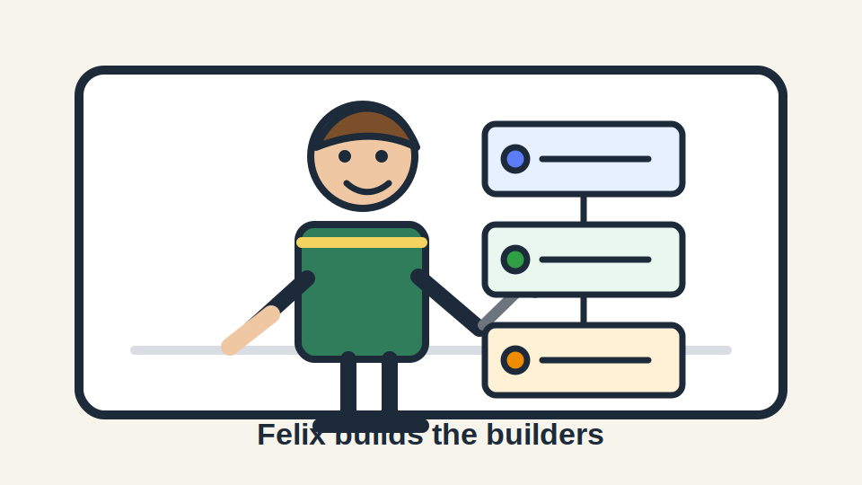

# Felix



Fix-it Felix is the agent-builder and maintainer for agent ecosystems.

Felix owns the standards, scaffolds, health checks, repair playbooks, and roadmap for the other agents. Reeves can route to Felix, but Felix should be the one that remembers what a healthy agent repo looks like.

Felix now lives with the Eidos AGI forges at:

```bash
~/repos-eidos-agi/felix
```

Public repo:

```bash
https://github.com/eidos-agi/felix
```

## Commands

```bash
felix doctor
felix self
felix agents list
felix agents show knox
felix standards
felix roadmap
felix scaffold-plan capcom
felix scaffold-plan dewey
```

## Boundaries

Felix builds and maintains agents. It does not become the operating system, the secrets vault, the communicator, the web surfer, or the adversarial reviewer.

Every agent Felix creates should have:

- private GitHub repo unless explicitly public
- installable CLI
- Scridos wiki checked into the repo
- Scridos project with milestones and tasks
- north-stars page
- self-improvement loop
- tests for core local behavior
- README with role, boundaries, commands, and safety gates
- original agent identity image or image prompt that avoids copyright imitation
- clear Reeves routing/memory entry
- an abstract agent interface so Felix can work on capabilities, not storage layout
- FOSS Forge health files when the agent may become reusable open-source software

## Design Principle

Felix should think like a Yoneda-flavored maintenance layer: operate on the agent's observable capabilities, then lower those operations into the concrete repo, wiki, task list, package, or installer shape. The CLI should stay about the work.

## FOSS Forge Alignment

Felix follows the FOSS Forge standard for agentic software:

- human layer: license, changelog, contributing guide, code of conduct, security policy
- agent layer: clear CLI descriptions, actionable errors, typed public behavior
- engineering layer: package metadata, tests, CI, small dependency surface

Felix is public alpha software under the Eidos AGI organization.

The mascot in this repo is original artwork inspired by the idea of a cheerful repair helper. It is not official Disney character art.

## Agent Identity Images

Felix encourages every agent to have a small visual identity kit:

- `assets/<agent>-mascot.svg` or `assets/<agent>-mascot.png`
- `assets/<agent>-image-prompt.md`
- README image placement near the title
- copyright-safe prompt language

Use image generation to create original agent art. Do not ask for a copyrighted character, living artist style, brand mascot, or near-copy of a protected design. Name the role, personality, materials, colors, environment, and composition instead.

### Felix Image Prompt

Use this as the pattern for Nano Banana or another image model:

```text
Create an original friendly repair-helper mascot for an open-source CLI named Felix.
The character is a cheerful builder/maintainer for agent ecosystems, holding a simple hammer and standing beside modular blocks labeled CLI, Wiki, Tasks, Tests, and CI.
Style: clean modern vector illustration, warm and practical, public-domain-friendly, no resemblance to any existing cartoon, game, movie, brand mascot, or copyrighted character.
Do not copy Fix-It Felix Jr. or any Disney/Wreck-It Ralph character design. Use a distinct outfit, face, body shape, color palette, and tool design.
Composition: centered mascot with a small agent scaffolding diagram, transparent or light background, readable at small README size.
```

### Template For New Agents

```text
Create an original mascot or identity image for an open-source CLI named <AGENT_NAME>.
Role: <WHAT_THE_AGENT_DOES>.
Personality: <3-5 TRAITS>.
Visual metaphor: <TOOLS, OBJECTS, OR ENVIRONMENT THAT REPRESENT THE WORK>.
Style: clean modern vector or product illustration, simple shapes, readable at small README size.
Copyright safety: do not resemble existing characters, brand mascots, movie/game/anime designs, living artists' styles, logos, or protected trade dress.
Output should feel new, ownable, and suitable for an open-source README.
```

## Registered Agents

- Knox: secrets and access.
- Capcom: mission-control communication.
- Dewey: AI librarian for local indexed context retrieval and token-cost reduction.

## Self-Documentation

Felix documents himself in:

- [CLAUDE.md](CLAUDE.md): operating instructions for agents working in this repo
- [docs/felix-self.md](docs/felix-self.md): identity, boundaries, and lifecycle
- [docs/foss-forge-compliance.md](docs/foss-forge-compliance.md): FOSS Forge compliance notes
- [docs/agent-identity-images.md](docs/agent-identity-images.md): prompt pattern for original agent art
- [wiki/felix/wiki/index.md](wiki/felix/wiki/index.md): Scridos wiki entrypoint

Felix dogfoods his own standards with:

```bash
felix self
```
